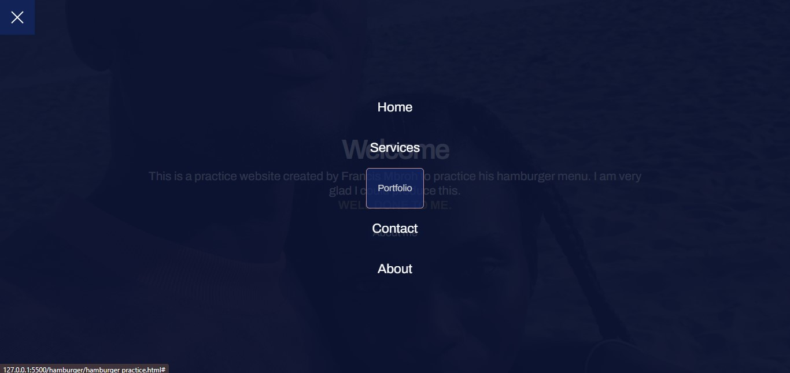

# Francis Mbroh - Animated Hamburger Menu - CSS HTML NO JS

Hi I'm Francis Mbroh. I'm a web developer who is avid to seeking solutions to everyday problems.
I wanted to create a hamburger with animation and I just did it. I believe being able to solve problems pivot on taking actions.
Feel comfy traversing my repositories😊.

## Table of contents

- [Welcome](#welcome)
- [Screenshot](#screenshot)
- [Links](#links)
- [Built with](#built-with)
- [Author](#author)

## Welcome

Thanks for checking out my project. In this project, I created an animated hamburger menu.

## Screenshot

## Links

- Live Site URL: [https://francismbroh.github.io/Animated-Hamburger-Menu/](https://francismbroh.github.io/Animated-Hamburger-Menu/) 

## Built with

- Semantic HTML5 markup
- CSS custom properties
- NO JS
- Flexbox
- Position
- For styles
- CSS variables

## Author

- FrancisMbroh - [ckid45119@gmail.com](ckid45119@gmail.com)
